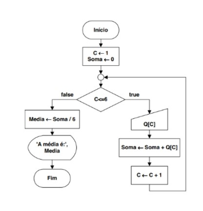

# Exercício 1A da AF
Média de alunos com vetor

## Algoritmo do Exercício

    INÍCIO
    C <- 1
    Soma <- 0

    ENQUANTO C <= 6 FAÇA
        LER(Q[C])
        Soma <- Soma + Q[C]
        C <- C + 1
    FIM ENQUANTO
    Média <- Soma/6
    EXIBIR('A média é: ' Media)

    FIM

## Fluxograma
